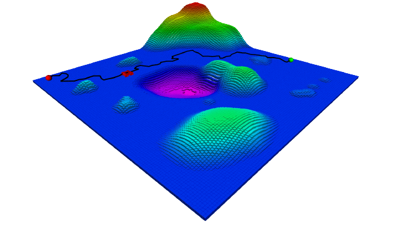
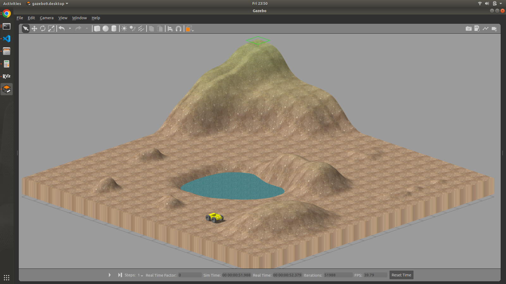
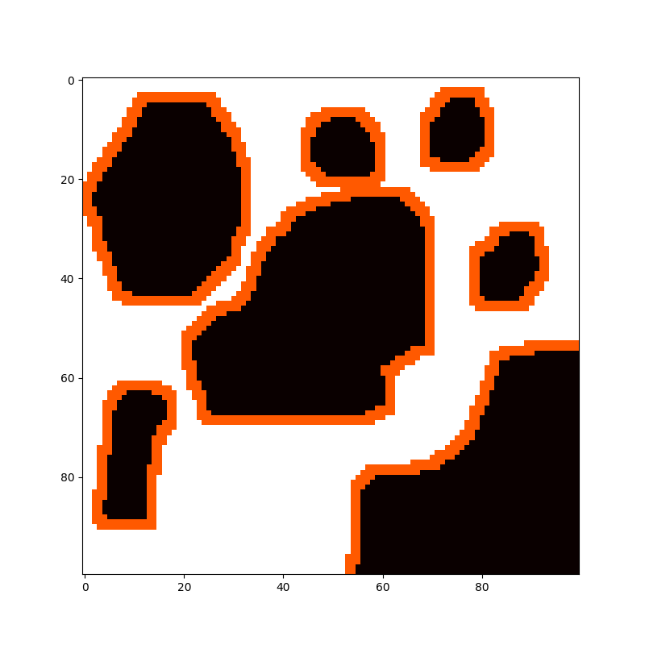
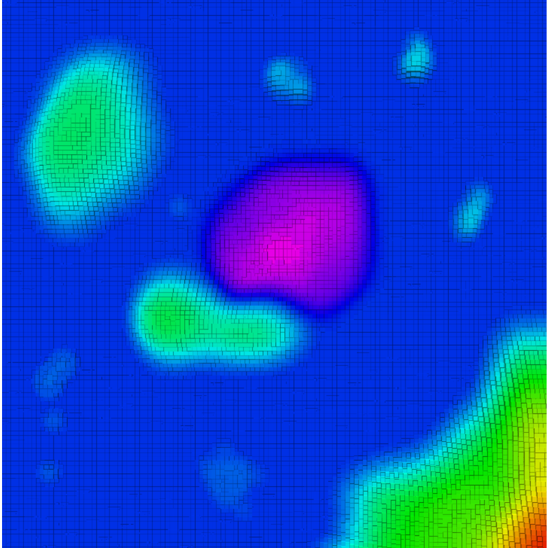
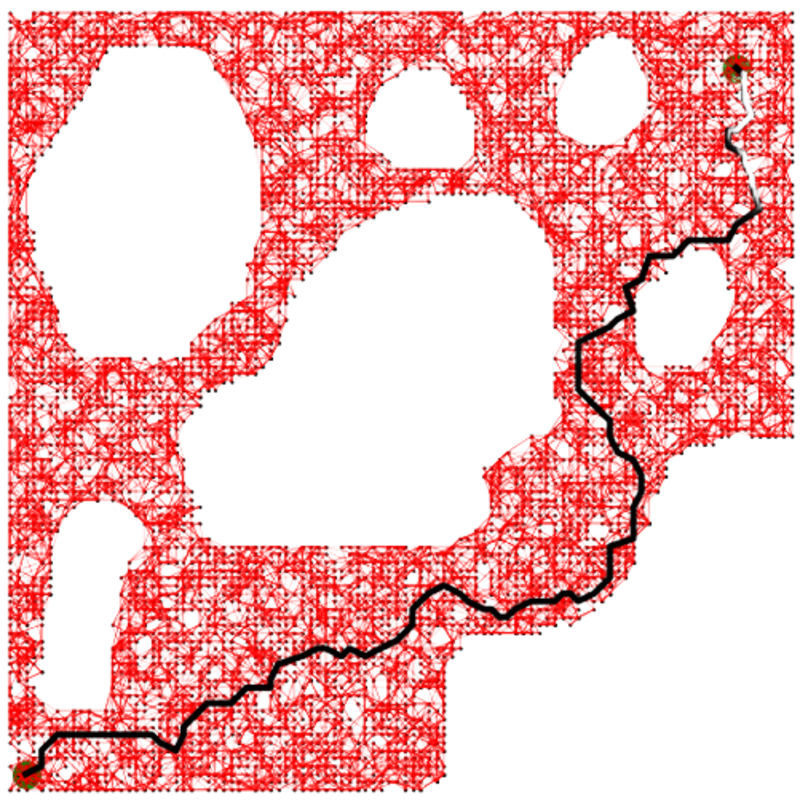

# Probabilistic Road Map mixed Artificial Potential Field Path Planning
## Overview
Probabilistic roadmap (PRM) algorithm generates graphs to perform path planning with complex constraints and high dimensions but has some limitations in situations like narrow pathways and environments with dynamic obstacles. This drawback of PRM is usually solved by increasing the number of randomly generated sampling points. However, too many sampling points will increase the computational complexity resulting in poor performance. Hence to overcome these limitations PRM with potential fields can be implemented. Potential field can be generated for the workspace, will help determine the complexity of workspace and adequate number of sampling points required, and then ensure high density of sampling points around the obstacles by implementing a regional sampling strategy.

[**Project Report**](./Report.pdf)

<p align="middle">
  
</p>

## Distribution of Sampling points using Adaptive solution:  

1) Calculate Repulsive potential for each point q in the map generated by obstacle qo.
2) Determine Number of Sampling Points.
3) Using bounding range for open area and obstacle region sampling point can be distributed in the map.

## Dependencies
- Ubuntu18
- ROS Melodic
- python3.x
- NumPy
- cv2
- panda
- Matplotlib
- sklearn
- shapely

## Steps to run the code
### Build and Install ROS dependencies
```bash
cd <your_workspace>/src
git clone https://github.com/Prat33k-dev/PRM-Blended-Potential-Field-Path-Planning.git
cd ../
rosdep install --from-paths src --ignore-src -r -y
catkin_make
```
### Genrate path coordinates file
First need to genrate .csv file of path coordinates to follow from start to goal location. 
```bash
cd <your_workspace>/src/PRM-Blended-Potential-Field-Path-Planning/prm_apf_planner
python3 src/main.py --start 6 1 --goal 19 19 --FilePath './map/map.png' 
```
#### Parameters
- start -  Start position of the robot. *Default :- [6 1]*
- goal - Goal position of the robot. *Default :- [19 19]*
- FilePath -  map file path. *Default :- './map/map.png'*

### Run the simulation
```bash
cd <your_workspace>
source /devel/setup.bash
roslaunch prm_apf_planner simulation.launch
```

## Results
Environment| Occupancy Map
:-:|:-:
 |   

### **Potential field**
Around the Obstacle | Heatmap
:-:|:-:
 |  

### **Path planned by PRM-APF blend**
<p align="middle">
  
</p>

### **Demonstration**
 

## Authors
- Pratik Bhujbal [GitHub](https://github.com/prat1kbhujbal)
- Maaruf Vazifdar [GitHub](https://github.com/maarufvazifdar)
## Refrences
> [1] H. You, G. Chen, Q. Jia and Z. Huang, 
> "Path Planning for Robot in Multi-
> dimensional Environment Based on Dynamic PRM Blended Potential
> Field," 2021 IEEE 5th Information Technology,Networking,Electronic
> and Automation Control Conference (ITNEC), 2021, pp. 1157-1162, doi:
> 10.1109/ITNEC52019.2021.9586848. ([Link](https://ieeexplore.ieee.org/abstract/document/9586848?casa_token=dPIeCWMbyvUAAAAA:jaPm7QkSNuVRAEtBoYQxnqkooVTZvR46ZT57qmRl7oLrsUHyPHaxxCWyf2-y8w6I4ts5512YXQ))

> [2] P. Fankhauser and M. Hutter,
> **"A Universal Grid Map Library: Implementation and Use Case for Rough Terrain Navigation"**,
> in Robot Operating System (ROS) – The Complete Reference (Volume 1), A. Koubaa (Ed.), Springer, 2016. ([PDF](http://www.researchgate.net/publication/284415855))

> [3] https://www.cs.cmu.edu/~motionplanning/lecture/Chap4-Potential-Field_howie.pdf.
